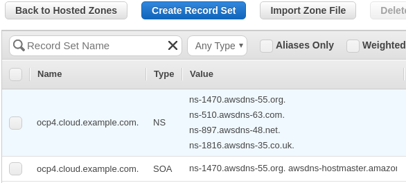
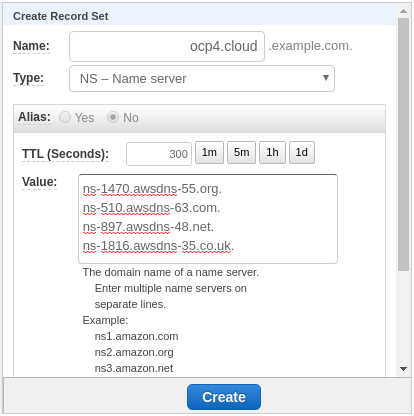
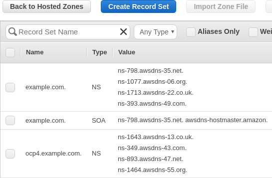

# OpenShift 4 Deploy

## Table of Contents

- [OpenShift 4 Deploy](#openshift-4-deploy)
  - [Table of Contents](#table-of-contents)
  - [Description](#description)
  - [Initial Setup](#initial-setup)
  - [AWS / AWS GovCloud](#aws--aws-govcloud)
    - [Create](#create)
    - [Start / Stop](#start--stop)
    - [Destroy](#destroy)
    - [Cluster Information](#cluster-information)
    - [Shell](#shell)

## Description

Deploy OpenShift 4 on the following platforms:

- AWS
- AWS GovCloud

:warning:	**IMPORTANT** :warning:

This project uses the **bare metal** method of installation on all platforms
listed above. This translates to there being **NO** integration with the underlying
infrastructure provider.

This means that OpenShift will not be able to:

- Autoscale using `MachineSets`
- Create load balancers automatically for your ingress routers
- Provision storage via the cloud provider plugin (e.g. EBS volumes)

If you would like a cluster that provides integration with the underlying
infrastructure provider, please see the built-in installation methods provided
with the OpenShift installer:
https://docs.openshift.com/container-platform/latest/welcome/index.html

## Initial Setup

**Step 1**

This project provides a container image that includes all of the dependencies
required to run the automation. To run the container image, you will need
either `podman` or `docker` installed on your system.

To install `podman`, follow the instructions here: https://podman.io/getting-started/installation.html

To install `docker`, follow the instructions here: https://docs.docker.com/get-docker/

**Step 2**

Clone this repository.

```bash
git clone https://github.com/jaredhocutt/openshift4-deploy.git
```

**Step 3**

Change your current directory to the cloned repository.

```bash
cd openshift4-deploy/
```

> **NOTE:** The following sections of documentation will assume that you are in
> the root directory of the clone repository.

## AWS / AWS GovCloud

In order to follow the steps below, you need to export your AWS credentials and
the region to use.

If you already have a profile setup using the `awscli`, you can export
`AWS_PROFILE`. Your `~/.aws` directory will already be mounted to the
environment for you.

```bash
export AWS_PROFILE=default
export AWS_REGION=us-east-1
```

Otherwise, export `AWS_ACCESS_KEY_ID`
and `AWS_SECRET_ACCESS_KEY`.

```bash
export AWS_ACCESS_KEY_ID=access_key
export AWS_SECRET_ACCESS_KEY=secret-key
export AWS_REGION=us-east-1
```

### Create

**Step 1: Create/Identify the SSH keypair for the Bastion host**

*If you already have an AWS key pair that you would like to use, you can skip
this step.*

If you do not have an AWS key pair or would like to create one specific to this
environment, log into the AWS console and create one in the region where you
will be deploying OpenShift 4.

Be sure to remember the **name** of the key pair and the **path** where you
saved the private key file (this is the `.pem` file that you download when
creating your AWS key pair) as you will need them in the next step.

IMPORTANT: The key pair `.pem` file should be in `~/.ssh` as this directory
gets mounted to the environment for you. Also ensure that you set the
permissions to `0600` as you would for any SSH key.

**Step 2: Create your variable file**

There are several variables that you will need to define before running the
deployment that are specific to your environment.

| Variable            | Required           | Default | Description                                                                                                                                                                                                                                                                                                                                                                                                                                                                                                                                                                                                                                                  |
| ------------------- | ------------------ | ------- | ------------------------------------------------------------------------------------------------------------------------------------------------------------------------------------------------------------------------------------------------------------------------------------------------------------------------------------------------------------------------------------------------------------------------------------------------------------------------------------------------------------------------------------------------------------------------------------------------------------------------------------------------------------ |
| `base_domain`       | :heavy_check_mark: |         | The base domain of the cluster.<br><br>All DNS will be sub-domains of this `base_domain` and include the `cluster_name`.                                                                                                                                                                                                                                                                                                                                                                                                                                                                                                                                     |
| `cloud`             | :heavy_check_mark: |         | The cloud provider to deploy to.<br><br>You should set this to `aws` to deploy to AWS and `aws_govcloud` to deploy to AWS GovCloud.                                                                                                                                                                                                                                                                                                                                                                                                                                                                                                                          |
| `cluster_name`      | :heavy_check_mark: |         | The cluster name.<br><br>This value will be in your DNS entries and should conform to valid DNS characters.                                                                                                                                                                                                                                                                                                                                                                                                                                                                                                                                                  |
| `keypair_name`      | :heavy_check_mark: |         | The name of the AWS key pair to use for the bastion host.                                                                                                                                                                                                                                                                                                                                                                                                                                                                                                                                                                                                    |
| `keypair_path`      | :heavy_check_mark: |         | The path to the private key for your AWS key pair.<br><br>Note: The private key's integrity will be maintained. It is only used by Ansible to connect to the bastion host.                                                                                                                                                                                                                                                                                                                                                                                                                                                                                   |
| `openshift_version` | :heavy_check_mark: |         | The OpenShift version to install.<br><br>The version must include the z-stream (e.g. 4.3.18)  The list of versions can be found [here][openshift_versions]                                                                                                                                                                                                                                                                                                                                                                                                                                                                                                   |
| `pull_secret`       | :heavy_check_mark: |         | The content of your pull secret, which can be found [here][pull_secret]. Be sure to wrap its value in single quotes.                                                                                                                                                                                                                                                                                                                                                                                                                                                                                                                                         |
| `fips_mode`         | :heavy_check_mark: |         | Set to True to install a cluster that has FIPS-validation enabled                                                                                                                                                                                                                                                                                                                                                                                                                                                                                                                                                                                            |
| `rhcos_ami`         | :heavy_check_mark: |         | The AMI ID for RHCOS.<br><br>If you are deploying into a commercial AWS region, the AMI ID can be found [here][rhcos_ami_ids]. Be sure the documentation you are looking at matches the version of OpenShift you are deploying to get the correct AMI IDs.<br><br>If you are deploying in AWS GovCloud, you will need to upload the RHCOS image and create your own AMI. After doing so, you can use that AMI ID for this variable. You can find details for creating a RHCOS AMI [here](docs/rhcos.md).<br><br>The intention is to add support to have this variable default to a sensible value, but at the moment you will need to provide the AMI ID.    |

[pull_secret]: https://cloud.redhat.com/openshift/install/pull-secret
[openshift_versions]: http://mirror.openshift.com/pub/openshift-v4/x86_64/clients/ocp/
[rhcos_ami_ids]: https://docs.openshift.com/container-platform/latest/installing/installing_aws/installing-aws-user-infra.html#installation-aws-user-infra-rhcos-ami_installing-aws-user-infra

Create a variable file at `<openshift4-deploy>/vars/aws.yml`. An example file
matching the content below can be found at
`<openshift4-deploy>/vars/aws.example.yml`.

```yaml
---

# The cloud provider to deploy to.
#
# The possible options are:
#   aws
#   aws_govcloud
cloud: aws

# The OpenShift version to install.
#
# The version must include the z-stream (e.g.4.4.3)
#
# The list of versions can be found at
# http://mirror.openshift.com/pub/openshift-v4/x86_64/clients/ocp/
openshift_version: 4.4.3

# The cluster name.
#
# This value will be in your DNS entries and should conform to valid DNS
# characters.
cluster_name: ocp4
# The base domain of the cluster.
#
# All DNS will be sub-domains of this base_domain and include the cluster_name.
base_domain: example.com

# The AMI ID for RHCOS.
#
# If you are deploying into a commercial AWS region, the AMI ID can be found
# here. Be sure the documentation you are looking at matches the version of
# OpenShift you are deploying to get the correct AMI IDs.
#
# If you are deploying in AWS GovCloud, you will need to upload the RHCOS image
# and create your own AMI. After doing so, you can use that AMI ID for this
# variable. You can find details for creating a RHCOS AMI here.
#
# The intention is to add support to have this variable default to a sensible
# value, but at the moment you will need to provide the AMI ID.
rhcos_ami: ami-123456789
# The name of the AWS key pair to use for the bastion host.
keypair_name: mykeypair
# The path to the private key for your AWS key pair.
#
# The private key's integrity will be maintained. It is only used by Ansible to
# connect to the bastion host.
keypair_path: ~/.ssh/mykeypair.pem

# The content of your pull secret, which can be found at
# https://cloud.redhat.com/openshift/install/pull-secret.
#
# Be sure to wrap its value in single quotes.
pull_secret: ''

# Install the cluster in FIPS mode
fips_mode: false
```

**Step 3: Create your DNS records (Public Zone and NS record)**

> If you are running in **AWS GovCloud**, you can't create a public
> zone because public zones are not supported yet. The automation will create a
> private zone for you. Proceed to the next step.

Log into the AWS console and create a public Route53 Hosted Zone for your
cluster.

The name **MUST** match the format `{{ cluster_name }}.{{ base_domain }}` using
the values you specified for those in your variable file. For example, if
`cluster_name` is `ocp4` and `base_domain` is `cloud.example.com`, then your
hosted zone should be `ocp4.cloud.example.com`.

After you create your hosted zone, you should see something similar to:



Copy the value for the `NS` record to your clipboard.

Go to your primary Route53 hosted zone for your domain (or subdomain), click
**Create Record Set** and add an `NS` record pointing to your new hosted zone.



After clicking **Create**, your primary Route53 hosted zone should look similar
to:



**Step 4: Run the automation**

Execute the automation to **create** your cluster.

```bash
./openshift-deploy create --vars-file vars/ocp4.yml
```

### Start / Stop

After your environment is provisioned, it's likely you'll want to shut it down
when you're not using it and be able to start it back up when you need it.

> **IMPORTANT:** You cannot shutdown your cluster until after it has been up
> for at least 24 hours due to short-lived certificates that get rotated at the
> 24 hour mark. There is a known workaround documented [here][24_hour_stop] but
> has not beed added to this deployment yet.

[24_hour_stop]: https://github.com/redhat-cop/openshift-lab-origin/blob/master/OpenShift4/Stopping_and_Resuming_OCP4_Clusters.adoc

Execute the automation to **start** your cluster.

```bash
./openshift-deploy start --vars-file vars/ocp4.yml
```

Execute the automation to **stop** your cluster.

```bash
./openshift-deploy stop --vars-file vars/ocp4.yml
```

### Destroy

Once you no longer need your cluster, you can use the automation to destroy
your cluster.

Be sure to execute the automation from the same machine where you created the
cluster as there is Terraform state data that is required to clean up all of
the resources previously created.

Execute the automation to **destroy** your cluster.


```bash
./openshift-deploy destroy --vars-file vars/ocp4.yml
```

### Cluster Information

When the automation to create a cluster completes, you are given output that
describes information about the cluster you just deployed. Sometimes it's
useful to get this information again.

> **NOTE:** Your cluster must be running for this to work. It requires
> connecting to your bastion host to pull important information about your
> cluster.

Execute the automation to display **information** about your cluster.

```bash
./openshift-deploy info --vars-file vars/ocp4.yml
```

### Shell

If you are trying to troubleshoot, make modifications to the automation, or
anything else that may require you to have access to an environment with all of
the software dependencies already available, you can open a shell into the
containerized environment.

Open a **shell** inside the containerized environment.

```bash
./openshift-deploy shell
```
